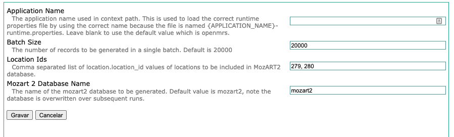

EPTS MozART II
==========================

Description
-----------
This module facilitates the generation of MozART II from OpenMRS user interface. Making it easy for any user with access
to the administration page of OpenMRS able to generate the database.

Building from Source
--------------------
You will need to have Java 1.6+ and Maven 2.x+ installed.  Use the command 'mvn package' to 
compile and package the module.  The .omod file will be in the omod/target folder.

Alternatively you can add the snippet provided in the [Creating Modules](https://wiki.openmrs.org/x/cAEr) page to your 
omod/pom.xml and use the mvn command:

    mvn package -P deploy-web -D deploy.path="../../openmrs-1.8.x/webapp/src/main/webapp"

It will allow you to deploy any changes to your web 
resources such as jsp or js files without re-installing the module. The deploy path says 
where OpenMRS is deployed.

Installation
------------
1. Build the module to produce the .omod file.
2. Use the OpenMRS Administration > Manage Modules screen to upload and install the .omod file.

If uploads are not allowed from the web (changable via a runtime property), you can drop the omod
into the ~/.OpenMRS/modules folder.  (Where ~/.OpenMRS is assumed to be the Application 
Data Directory that the running openmrs is currently using.)  After putting the file in there 
simply restart OpenMRS/tomcat and the module will be loaded and started.

Running
-------
To run simply navigate to MozART 2 generation page from the Administration page menu.

The module connects to the database using the openmrs runtime properties file's properties. Moreover, 
there are other global properties which have default values. The user can override these of course. Please see below for
available global properties.

